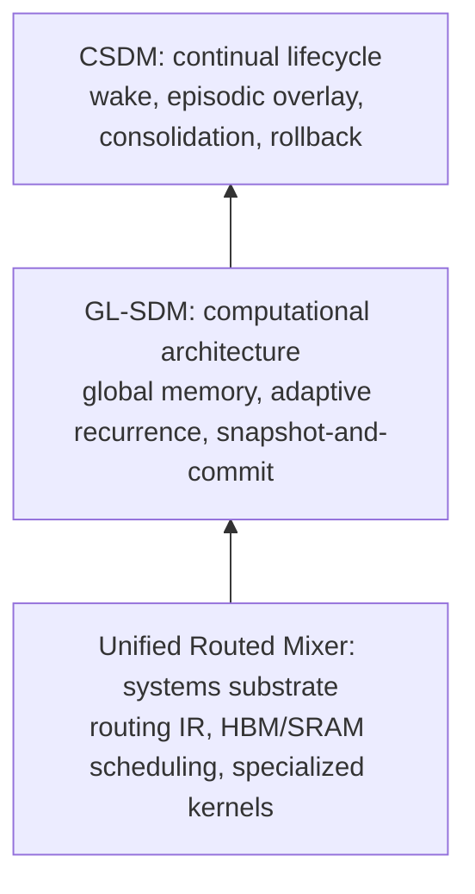
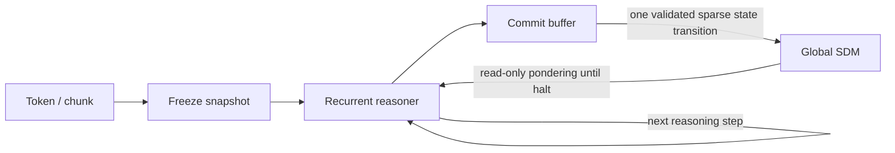
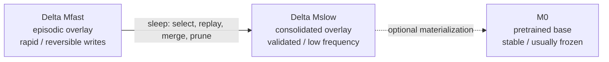

# Global Liquid Sparse Delta Memory

> Adaptive computation, continual consolidation, and a unified routed-mixer
> systems substrate

| Field | Value |
| --- | --- |
| Program | Three coordinated, independently falsifiable research proposals |
| Status | Working proposal for literature review, design, and staged validation |
| Literature cutoff | 26 August 2026 |
| Archival source | [Global Liquid SDM Research Program (PDF)](../archive/Global_Liquid_SDM_Research_Program.pdf) |

## Core thesis

> A language model can separate knowledge capacity from sequential depth by
> repeatedly reasoning over one globally shared, model-scale sparse memory,
> while using sparse overlays and offline consolidation to learn continually
> without rewriting its full static network.

## Contents

- [1. Program summary and research thesis](#1-program-summary-and-research-thesis)
- [2. Problem statement and design principles](#2-problem-statement-and-design-principles)
- [3. Prior-art and novelty audit](#3-prior-art-and-novelty-audit)
- [4. Shared formal model](#4-shared-formal-model)
- [5. Proposal I - Global Liquid SDM](#proposal-i)
- [6. Proposal II - Consolidated SDM](#proposal-ii)
- [7. Proposal III - Unified Routed Mixer](#proposal-iii)
- [8. Integrated experimental program](#8-integrated-experimental-program)
- [9. Risks, safety, governance, and failure criteria](#9-risks-safety-governance-and-failure-criteria)
- [10. Roadmap, resources, and expected outputs](#10-roadmap-resources-and-expected-outputs)
- [11. References](#11-references)
- [Appendix A. Minimal interfaces](#appendix-a-minimal-interfaces)
- [Appendix B. Claim ledger](#appendix-b-claim-ledger)
- [Appendix C. Immediate next decisions](#appendix-c-immediate-next-decisions)

## 1. Program summary and research thesis

**Proposal in one sentence:** Build a model-scale sparse memory that is
simultaneously pretrained knowledge, online state, and a persistent
continual-learning substrate; expose it globally to a weight-tied adaptive
reasoner; and execute it through a constrained routed-mixer systems layer.

Modern sequence models divide knowledge and computation across static
parameters, layer-local recurrent states, attention caches, and optional
external memories. This fragmentation creates engineering and learning
problems. Online adaptation may target a KV cache, a recurrent state, an
optimizer state, or model parameters, each with different persistence,
stability, and deployment semantics. The proposed program asks whether one
explicitly addressable Sparse Delta Memory (SDM) can become the main mutable
substrate instead.

SDM is compelling because it scales recurrent state through sparse addressing
and learns its initial memory as parametric knowledge [1]. Nested Learning
provides the broader interpretation that learning systems contain optimization
processes at multiple levels and frequencies [2]. The proposed synthesis treats
the SDM state as the common target for these levels: a learned base state, a
rapidly writable episodic overlay, and a slowly consolidated overlay.

The word *global* means physically and semantically shared across model depth,
reasoning iterations, and potentially multiple computational modules. *Liquid*
means that access order and computation depth are dynamically routed rather
than fixed by a stack of unique layers. It does not mean that every weight is
continuously rewritten. Most controller parameters can remain static while
knowledge-bearing memory is read and modified sparsely.



*Figure 1. The research program is a stack of three separable contributions.
Each layer has independent hypotheses and failure criteria.*

### 1.1 Three proposals, one research program

| Proposal | Primary question | Independent contribution | Dependency |
| --- | --- | --- | --- |
| I. GL-SDM | Can tokens reason adaptively over one model-scale mutable memory? | Global address space, tied recurrence, snapshot-and-commit | SDM operator |
| II. CSDM | Can that memory learn continually without destructive interference? | Fast/slow overlays, sleep, rollback, stability controls | GL-SDM semantics |
| III. URM | Can the operator execute efficiently across mixer families? | Restricted routed-mixer IR and specialized kernels | Independent; GL-SDM is flagship |

### 1.2 Program-level hypotheses

- **Capacity hypothesis:** recurrent reasoning over a model-scale sparse memory
  can recover knowledge capacity that would otherwise be lost when unique
  feed-forward layers are replaced by weight-tied computation.
- **Compute hypothesis:** adaptive recurrent depth allocates more computation
  to difficult tokens without requiring every earlier token's KV state to be
  recomputed.
- **Plasticity hypothesis:** sparse overlays in a common address space provide a
  cleaner continual-learning target than modifying arbitrary static parameters,
  layer-local states, or a growing KV cache.
- **Stability hypothesis:** snapshot-and-commit semantics, orthogonal novelty
  filtering, and curvature-aware updates reduce self-interference during both
  online reasoning and long-horizon learning.
- **Systems hypothesis:** a restricted gather-score-reduce-update abstraction
  can cover the relevant mixers while retaining enough structure for specialized
  SRAM/HBM implementations.

### 1.3 Scope and non-claims

The program does not claim that external memory, adaptive computation,
fast/slow learning, test-time training, sleep consolidation, global parameter
sharing, or sparse product-key retrieval are individually new. Each has
substantial prior art. The candidate novelty lies in their exact conjunction and
in demonstrating that conjunction at language-model and systems scale.

> **Claim discipline:** Until broader citation chaining and patent review are
> complete, use "we introduce and evaluate" rather than "the first." The
> strongest candidate claim is a model-scale sparse delta memory shared across
> adaptive recurrent depth and trained as a multi-timescale continual substrate.

## 2. Problem statement and design principles

### 2.1 The fragmented-state problem

A deployed model may hold information in at least four places: static weights,
a KV cache, recurrent states, and retrieved external records. Continual-learning
methods add optimizer states, adapters, replay buffers, or parameter deltas. The
result is a collection of storage systems with incompatible update rules and
lifetimes. The central design move is to make a prepared, learned, sparse memory
state the explicit mutable target and to keep most transformation parameters
static.

This choice is not merely conceptual. Sparse updates create a smaller
interference surface than dense parameter updates. A memory table also admits
copy-on-write overlays, transactional commits, versioning, provenance, access
control, and selective rollback. Those properties are difficult to impose on
arbitrary hidden parameters after deployment.

### 2.2 Why global access may simplify parameter recurrence

Conventional depth recurrence must preserve an evolving sequence representation
and often depends on token states produced at previous depths. In a GL-SDM
design, a token's recurrent reasoner repeatedly consults one stable memory
snapshot. The token can therefore take a variable number of internal steps while
its memory transaction remains isolated. This does not eliminate all sequencing
constraints - causal token dependencies and shared-memory consistency remain -
but it makes per-token recurrence more modular.

The architecture separates two clocks. The reasoning clock advances latent
computation for a token or chunk. The memory clock advances only when tentative
sparse writes are committed. This makes variable compute compatible with
deterministic memory state transitions and avoids repeatedly rewriting the state
that the current reasoning loop is still reading.



*Figure 2. Proposed two-clock execution. Recurrent thought reads a frozen view;
sparse writes are merged and committed at a transaction boundary.*

### 2.3 Design principles

- **One address space, several persistence tiers.** Tiers differ in lifetime and
  trust, not in semantic coordinates.
- **Read many times, commit once.** Recurrent reasoning sees a stable memory
  version unless an experiment explicitly tests coupled writes.
- **Sparse by construction.** Retrieval, update, consolidation, and rollback
  operate on selected slots or pages.
- **Knowledge capacity is decoupled from unique depth.** Large memory holds
  content; a smaller tied reasoner manipulates it.
- **Adaptive compute is budgeted.** Halting must be trained and evaluated against
  quality, mean steps, and tail latency.
- **The system is reversible by default.** Online writes retain provenance and
  can be expired or rolled back.
- **Kernel abstractions remain constrained.** The systems layer exposes
  structured routing, not arbitrary tensor algebra.

## 3. Prior-art and novelty audit

A primary-source scan through 26 August 2026 indicates that the program is
viable but compositionally novel. Several works occupy adjacent corners of the
design space, and Memoir comes particularly close to the high-level combination.
The proposal must therefore win on exact mechanism, scale, continual-learning
evidence, and system performance.

### 3.1 Foundational lineages

- **Differentiable external memory:** Neural Turing Machines coupled a learned
  controller to an addressable memory [17].
- **Weight-tied adaptive depth:** Universal Transformers introduced recurrent
  self-attention with dynamic per-position halting [18]; later work studies the
  depth-state trade-off and the need for learned memory tokens [19].
- **Complementary learning systems:** the hippocampal fast-learning and
  neocortical slow-learning distinction, including replay, predates modern neural
  continual learning [26].
- **Test-time neural memory:** Titans, ATLAS, FwPKM, and in-place TTT update
  memory or repurposed model components during inference [13, 20-22].
- **Brain-inspired continual learning:** wake-sleep consolidation and
  thalamically routed modular architectures already connect replay, routing, and
  multiple learning rates [24, 25].

### 3.2 Closest contemporary overlaps

| Work | Direct overlap | What remains different |
| --- | --- | --- |
| Memoir [12] | Fast/slow delta memory, variable-depth latent recurrence, adaptive halting, proposed sleep interface | Small dense memory; toy recall; no language-scale continual consolidation |
| FwPKM [13] | Sparse product-key fast weights updated online at activated slots | Layer/module memory; no global adaptive recurrent address space or sleep |
| Memory Layers at Scale [15] | Huge sparse product-key parameter memory shared across layers | Static after training; retrieval-focused kernels; no online delta overlays |
| Adaptive Loops and Memory [14] | Adaptive looping with local/global learned memory banks | Memory is static learned context, not persistent online state |
| Mobius [9] | Globally shared knowledge vectors repeatedly queried by reasoners | Static knowledge database; no sparse continual write lifecycle |
| BDH / BDH-CQ [10, 11] | Plastic recurrent state and iterative latent reasoning | No exposed model-scale shared SDM with common-address overlays |
| Language Models Need Sleep [5, 16] | Offline recurrence, multi-frequency memory, consolidation | Different memory substrates; does not establish the proposed global sparse transactional state |

### 3.3 Novelty matrix

| System | Global | Model-scale sparse | Online write | Adaptive loop | Consolidation |
| --- | --- | --- | --- | --- | --- |
| NTM | Yes | No | Yes | No | No |
| Memory Layers | Yes | Yes | No | No | No |
| FwPKM | Partial | Yes | Yes | No | No |
| Adaptive Loops | Yes | No | No | Yes | No |
| Mobius | Yes | Partial | No | Yes | No |
| BDH-CQ | Partial | Unclear | Yes | Yes | No |
| Memoir | Partial | No | Yes | Yes | Proposed |
| Proposed GL/CSDM | Yes | Yes | Yes | Yes | Evaluated |

### 3.4 Research gap

No reviewed work establishes all of the following in one evaluated system: one
physical sparse address space shared across depth and recurrent reasoning;
learned initial state plus episodic and consolidated overlays in the same
coordinates; adaptive read-only pondering with transactional sparse commits;
measured deployment-time consolidation; and an HBM-aware read/write
implementation. This gap defines the program.

## 4. Shared formal model

### 4.1 Memory representation

Let the global memory contain $N$ addressable slots with key dimension $d_k$ and
value dimension $d_v$. The effective memory is the composition of three aligned
tiers:

$$
M_{\mathrm{eff}} = M_0 + \Delta M_{\mathrm{slow}} + \Delta M_{\mathrm{fast}}
$$

$M_0$ is learned during pretraining and is normally immutable after release.
$\Delta M_{\mathrm{slow}}$ contains consolidated, validated knowledge.
$\Delta M_{\mathrm{fast}}$ contains recent, reversible episodic writes. A
deployment can maintain additional policy or user overlays without changing the
basic operator, provided precedence and authorization are explicit.

### 4.2 Sparse addressing and reads

$$
I(q) = \operatorname{TopK}_i \operatorname{score}(q, K_i)
$$

$$
\operatorname{Read}(q, M) = \sum_{i \in I(q)} a_i(q) M_{\mathrm{eff}}[i]
$$

The router may use product keys, learned hash partitions, coarse-to-fine pages,
or another sparse index. Top-k selection must remain stable enough for training
while producing page locality at inference. The key scientific question is
whether shared addressing permits knowledge learned in one computational
context to be reused from another without duplicating parameters across layers.

### 4.3 Recurrent reasoning and halting

$$
h_t^{(r+1)} = F_\theta\left(h_t^{(r)},
\operatorname{Read}(q_t^{(r)}, \bar{M}_t), x_t\right)
$$

$$
p_{\mathrm{halt}}(t,r) = H_\phi(h_t^{(r)}), \qquad
R_t = \min\{r : \text{halt condition is satisfied}\}
$$

$\bar{M}_t$ is a versioned snapshot. $F_\theta$ is weight-tied across recurrent
depth. Halting can be trained with ACT-, PonderNet-, or budget-regularized
objectives, but evaluation must expose the full distribution of $R_t$ rather
than only its mean.

### 4.4 Tentative writes and transaction boundaries

$$
B_t^{(r)} = \operatorname{WriteProposal}(h_t^{(r)}, \bar{M}_t)
$$

$$
M_{t+1} = M_t + \operatorname{Commit}\left(
\operatorname{Merge}_r B_t^{(r)}\right)
$$

This proposal adopts read-only pondering as the default because Memoir reports a
learning-speed penalty when each pondering iteration rewrites the memory that it
also reads [12]. That result is small-scale and ceiling-limited, so GL-SDM must
test whether the effect persists in language modelling and larger sparse
memories.

### 4.5 Stability-controlled delta update

$$
\Delta M[i] = \eta \cdot \operatorname{gate}_i \cdot P_i \cdot
\operatorname{novelty}_i \cdot \operatorname{error}_i
$$

The update decomposes into a learned step size, access gate, preconditioner,
novelty projection, and local error. Lattice motivates orthogonal novelty
filtering to reduce redundant writes [3]. Preconditioned DeltaNet motivates
curvature-aware scaling [4]. These are optional mechanisms to be ablated rather
than assumptions built into the GL-SDM definition.

<a id="proposal-i"></a>

## 5. Proposal I - Global Liquid SDM

**Research question:** Can a weight-tied model allocate variable computation per
token while repeatedly accessing one globally shared, model-scale sparse delta
memory, and thereby improve the quality-compute-capacity frontier?

### 5.1 Proposed architecture

GL-SDM replaces a large fraction of layer-unique knowledge parameters with a
shared sparse memory and a smaller recurrent reasoner. The reasoner may retain
lightweight attention and normalization modules, but its knowledge-bearing
feed-forward capacity is increasingly supplied by the global memory. Tokens or
chunks enter the reasoner, retrieve sparse memory values, update their latent
state, decide whether to halt, and finally commit a validated sparse write
buffer.

Unlike a KV cache, memory access does not require the model to construct a new
per-layer key/value representation for every previous token at every recurrent
depth. Unlike a static global FFN database, the memory can incorporate new
associations after deployment. Unlike a small linear-attention state, capacity
can scale toward the model's static parameter count while compute remains tied
to top-k access rather than total memory size.

### 5.2 Architectural variants

| Variant | Memory sharing | Reasoning | Write semantics |
| --- | --- | --- | --- |
| GL-SDM Core | One table across all recurrent steps | Fixed number of tied steps | One commit per chunk |
| Liquid GL-SDM | One table across steps and modules | Adaptive token/chunk halting | Snapshot-and-commit |
| Hierarchical GL-SDM | One global table plus small local scratch state | Adaptive recurrence | Local scratch plus global commit |
| Overlay GL-SDM | Base plus session/user overlays | Adaptive recurrence | Copy-on-write sparse deltas |

### 5.3 Hypotheses

- **H1:** At matched training FLOPs and active parameters, globally shared SDM
  improves retrieval and knowledge-intensive performance over layer-local SDM by
  increasing reusable capacity.
- **H2:** Adaptive recurrent depth improves difficult-token accuracy at matched
  average inference compute relative to fixed-depth recurrence.
- **H3:** Snapshot-and-commit training converges faster and is more stable than
  write-while-thinking when the memory is large and sparsely addressed.
- **H4:** Global memory reduces the parameter cost of increasing recurrent depth
  because the same knowledge substrate is available at every step.
- **H5:** Page-local routing and recurrent address reuse make HBM-resident memory
  practical without requiring the entire state in SRAM.

### 5.4 Experimental design

The first stage should isolate semantics before pursuing scale. A 50M-200M
parameter reasoner with memory sizes from 1x to 16x the active model size can
test associative recall, key interference, algorithmic transformations,
variable-depth reasoning, and long-context retrieval. The second stage should
train 300M-1B language models with equalized FLOPs and active parameter counts.
A later stage can scale memory capacity independently of active compute.

| Axis | Controlled comparison | Primary measures |
| --- | --- | --- |
| Memory scope | Layer-local vs global shared SDM | Recall, perplexity, slot reuse, bandwidth |
| Depth | Unique layers vs fixed tied loops vs adaptive loops | Accuracy, mean/percentile steps, latency |
| Write timing | Every loop vs final loop vs merged commit | Convergence, corruption, variance |
| Capacity | Memory slots at matched active FLOPs | Scaling curve and collision rate |
| Residency | SRAM-sized state vs HBM table with locality | Tokens/s, bytes/token, cache hit rate |

### 5.5 Baselines

- Transformer and weight-tied Universal Transformer at matched training and
  inference FLOPs [18].
- Gated DeltaNet or linear-attention recurrent baseline with conventional small
  dense state.
- Layer-local SDM using the original learned initial-state formulation [1].
- Static Memory Layers at Scale-style shared product-key memory [15].
- FwPKM for sparse online episodic memory [13].
- Adaptive Loops and Memory, Mobius-style shared knowledge, and Universal
  Transformers Need Memory [9, 14, 19].
- Memoir for the coupling of fast memory, slow parameters, and adaptive pondering
  [12].
- BDH-CQ when an exact reproducible implementation permits mechanism-level
  comparison [11].

### 5.6 Success and failure criteria

A credible positive result requires more than improved retrieval. GL-SDM should
achieve a better Pareto frontier across downstream quality, average and tail
compute, memory capacity, and throughput. It fails as an architecture
contribution if gains disappear under matched active parameters and memory
bandwidth, if adaptive halting collapses to nearly constant depth, or if global
sharing produces unacceptable routing contention and interference.

<a id="proposal-ii"></a>

## 6. Proposal II - Consolidated SDM

**Research question:** Can sparse memory overlays support rapid deployment-time
learning while sleep consolidation preserves useful knowledge, limits
interference, and provides rollback and provenance?

### 6.1 Memory lifecycle

CSDM turns GL-SDM from a recurrent architecture into a continual-learning
system. The key idea is not merely to maintain fast and slow memories, but to
align them to the same address space. An effective read composes the pretrained
base, consolidated overlay, and episodic overlay at selected addresses. Sleep
moves information between tiers without changing the external read interface.



**Effective read:** $M_0 + \Delta M_{\mathrm{slow}} + \Delta M_{\mathrm{fast}}$

*Figure 3. CSDM uses common-address overlays. Sleep promotes, merges, compresses,
rejects, or expires sparse deltas rather than retraining the full network by
default.*

### 6.2 Wake phase

1. Route an experience to top-k addresses and read the effective
   base-plus-overlay values.
2. Generate a tentative local delta using prediction error, surprise, task
   utility, or an explicit teaching signal.
3. Apply novelty, trust-region, curvature, and policy gates before committing to
   the episodic overlay.
4. Record provenance, confidence, timestamp, access scope, and a reversible
   version identifier.
5. Evaluate immediate benefit and defer promotion until sufficient evidence
   accumulates.

### 6.3 Sleep phase

$$
\operatorname{Sleep}(\Delta M_{\mathrm{fast}}, \Delta M_{\mathrm{slow}}, M_0)
\rightarrow
(\Delta M'_{\mathrm{fast}}, \Delta M'_{\mathrm{slow}})
$$

A sleep event can occur after a session, after a write budget is reached, when
collision or uncertainty grows, or during scheduled offline capacity. It should
not be equated with unconstrained fine-tuning. The proposed process is sparse,
replay-based, and validation-gated.

1. Select candidate episodic traces using utility, recurrence, novelty,
   uncertainty, and conflict scores.
2. Replay candidates with representative base and consolidated examples to
   estimate retention and transfer.
3. Merge compatible deltas into the slow overlay using preconditioned or
   orthogonalized updates.
4. Reject, quarantine, or retain uncertain traces in the fast tier.
5. Compress redundant slots, reclaim capacity, and update routing metadata.
6. Run regression and policy checks; publish a new memory version only if
   acceptance criteria pass.

### 6.4 Stability mechanisms

| Mechanism | Purpose | Primary ablation |
| --- | --- | --- |
| Orthogonal novelty filter | Avoid rewriting directions already represented | Lattice-inspired projection vs no projection [3] |
| Curvature preconditioner | Scale updates according to local geometry | Diagonal PGDN-style state vs scalar step [4] |
| Write budget | Bound cumulative change per session/address | Fixed, adaptive, and no budget |
| Collision monitor | Detect unrelated concepts sharing slots | Rehash, allocate, or quarantine |
| Replay mixture | Preserve base and prior consolidated behavior | Random, prioritized, generative |
| Versioned overlay | Enable rollback and forensic comparison | Transactional vs destructive update |

### 6.5 Continual-learning evaluation

Evaluation must include controlled synthetic streams and realistic text streams.
Synthetic streams make address collisions, concept recurrence, contradictions,
and distribution drift measurable. Realistic streams should include temporal
knowledge updates, sequential domains, personalized preferences under consent,
correction of prior facts, and long gaps between learning and recall.

| Metric | Interpretation |
| --- | --- |
| Average retained accuracy | Performance over all learned episodes after each stage |
| Forgetting | Peak historical performance minus current performance |
| Forward transfer | Benefit to a new task before direct training |
| Backward transfer | Improvement or damage to earlier tasks after new learning |
| Write efficiency | Useful retained bits or score gain per written byte/FLOP |
| Interference surface | Unaffected probes changed per committed address |
| Consolidation yield | Promoted utility retained per sleep compute budget |
| Rollback fidelity | Recovery after removing a harmful or incorrect memory version |

### 6.6 Baselines and decisive ablations

- Online full or adapter fine-tuning, replay-based continual learning, and
  parameter-isolation methods.
- Titans, ATLAS, FwPKM, in-place TTT, and learned recurrent initial-state
  adaptation [13, 20-23].
- Single-tier GL-SDM without sleep; separate unaligned fast/slow memories; and
  aligned overlays without consolidation.
- Sleep with and without replay, novelty projection, preconditioning, validation
  gates, and capacity reclamation.
- Per-token coupled writes versus transactional writes to distinguish reasoning
  instability from long-horizon forgetting.

### 6.7 Success and failure criteria

CSDM succeeds only if it improves the retention-plasticity frontier at bounded
storage and consolidation compute. It fails if the fast overlay merely acts as a
larger context cache, if consolidation performs no better than replay
fine-tuning, if routing drift makes old memories unreachable, or if safe rollback
cannot reconstruct prior behavior.

<a id="proposal-iii"></a>

## 7. Proposal III - Unified Routed Mixer

**Research question:** Can attention, expert routing, parameter-token mixing,
linear recurrence, and sparse memory access share a constrained execution
representation without collapsing into an unoptimizable general tensor
language?

### 7.1 Operator abstraction

$$
y_i = \operatorname{Reduce}_{j \in R(i)}
\left[g(q_i, k_j; \mathrm{mode}) \cdot v_j\right];
\quad \text{optional } \operatorname{Update}(j, \delta_j)
$$

The proposed Unified Routed Mixer (URM) is a
gather-score-weighted-reduce-scatter family. It fixes the broad computational
skeleton while allowing a small set of declared choices: routing domain,
selection rule, normalization, value transform, state mutability, residency, and
update timing. This is intentionally less general than `einsum`.

A standard MLP should not be claimed as literally identical to attention.
Instead, URM can represent block-routed or parameter-token formulations of
dimension mixing, inspired by TokenFormer [7]. Multi-Head LatentMoE motivates
expressing expert routing through attention-compatible head structure [6]. The
scientific and systems question is whether these formulations preserve model
quality while exposing reusable scheduling and kernel machinery.

### 7.2 Mixer mapping

| Mixer | Routing domain | Selection/normalization | State behavior |
| --- | --- | --- | --- |
| Softmax attention | Sequence positions | Dense causal or bidirectional softmax | Read-only KV for a pass |
| Sparse attention | Sequence positions | Top-k/block sparse softmax | Read-only KV for a pass |
| MoE | Experts or parameter blocks | Top-k gated routing | Static parameters |
| Parameter-token mixer | Learned parameter tokens | Attention-like selection | Static or adapter-updated |
| Linear attention | Sufficient-statistic state | Kernelized dense update | Small recurrent read/write |
| SDM / GL-SDM | HBM memory addresses | Sparse top-k gated retrieval | Large transactional read/write |

### 7.3 Restricted intermediate representation

- Domains are typed: sequence, expert, parameter block, recurrent state, or
  memory page.
- Routing is one of dense, block-sparse, top-k, product-key, or kernelized
  recurrence.
- Reduction is a weighted sum with a bounded set of normalization and gating
  modes.
- Shapes use fixed head dimensions and declared top-k/page sizes suitable for
  compilation.
- Mutation is explicitly absent, in-place recurrent, buffered, or transactional.
- Residency and reuse are declared so the scheduler can choose SRAM staging,
  HBM gather, prefetch, or distributed sharding.
- Determinism, capacity constraints, and collision policy are part of the
  operator contract.

### 7.4 GL-SDM kernel path

1. Compute coarse or product-key routing scores and produce address/page IDs.
2. Group queries by page and coalesce HBM reads across tokens, heads, and
   recurrent iterations.
3. Stage hot values and overlay fragments in SRAM while retaining the full
   memory in HBM.
4. Fuse base-plus-overlay composition with the weighted reduction where
   possible.
5. Accumulate tentative writes in a compact buffer, resolve duplicate addresses,
   and apply one commit.
6. Emit routing, collision, bandwidth, and version metadata for profiling and
   safety audits.

### 7.5 Systems experiments

| Experiment | Question | Measures |
| --- | --- | --- |
| Microkernel | What is the cost of routing, gather, reduction, and commit? | GB/s, TFLOP/s, occupancy, launch overhead |
| Locality | Do page grouping and recurrent reuse reduce HBM traffic? | Bytes/token, hit rate, prefetch accuracy |
| Fusion | Can overlay composition and reduction be fused? | Latency, temporary bytes, numerical error |
| Distributed | How does the global table shard across devices? | Communication bytes, load balance, tail latency |
| End-to-end | Does URM match hand-written mixer kernels? | Tokens/s and quality at identical numerics |

### 7.6 Success and failure criteria

URM succeeds if one IR covers the target operators while each lowers to a
competitive specialized backend and GL-SDM obtains practical HBM utilization.
It fails if abstraction overhead materially exceeds hand-written kernels, if
dynamic routing destroys locality, or if numerical and semantic differences
force each mixer into an unrelated special case.

## 8. Integrated experimental program

### 8.1 Staged dependency plan

1. **Semantics first:** implement dense/small GL-SDM and verify routing,
   snapshot, halting, and commit behavior on controlled tasks.
2. **Sparse architecture:** replace dense state with model-scale sparse
   addressing and test memory/depth trade-offs.
3. **Continual lifecycle:** add aligned overlays, write governance, and offline
   consolidation only after single-tier behavior is understood.
4. **Systems co-design:** profile address traces from real models, then design
   page-local scheduling and write fusion around observed distributions.
5. **Scale validation:** jointly train the best architecture and kernel
   configuration at 300M-1B active parameters with larger memory capacity.
6. **Long-horizon deployment simulation:** run repeated wake/sleep cycles,
   corrections, contradictions, and rollback under fixed storage and compute
   budgets.

### 8.2 Shared benchmark suite

| Capability | Controlled task | Language-model task |
| --- | --- | --- |
| Sparse recall | Key-value recall with collisions and distractors | Needle retrieval and book/document recall |
| Adaptive reasoning | Variable-depth algorithms and transformations | Multi-hop QA, code, math, structured reasoning |
| Knowledge insertion | Novel associations and contradiction streams | Temporal facts and correction sets |
| Continual retention | Recurring concepts with controlled overlap | Sequential domains and instructions |
| Consolidation | Fast-to-slow transfer with known ground truth | Session-to-session retention under sleep budgets |
| Systems | Synthetic address distributions | End-to-end routing traces and generation latency |

### 8.3 Experimental controls

- Match training FLOPs, active parameters, optimizer budget, data, and memory
  bandwidth where the scientific question permits.
- Report total memory capacity separately from active retrieved parameters and
  from mutable state bytes.
- Measure average and percentile recurrent steps, not only nominal maximum
  depth.
- Distinguish transient context recall from durable learning across sessions and
  after intervening experience.
- Evaluate routing stability, address collision, and memory utilization
  alongside task accuracy.
- Use multiple seeds for halting and coupled-write experiments because recurrent
  optimization can be unstable.
- Publish negative scaling results and resource-normalized Pareto curves rather
  than a single best operating point.

### 8.4 Core ablation grid

| Component | Off | On | Interpretation |
| --- | --- | --- | --- |
| Global sharing | Per-layer memory | One shared table | Tests reuse vs specialization |
| Adaptive depth | Fixed loops | Learned halting | Tests conditional computation |
| Transactional write | Write every loop | Commit after halt | Tests self-interference |
| Overlay alignment | Separate memories | Common addresses | Tests compositional state |
| Sleep | No promotion | Validated consolidation | Tests durable retention |
| Novelty/preconditioner | Plain delta | Orthogonal/curvature-aware | Tests stability |
| Page locality | Raw random top-k | Grouped/local routing | Tests systems feasibility |

## 9. Risks, safety, governance, and failure criteria

### 9.1 Scientific risks

| Risk | Consequence | Mitigation / decision rule |
| --- | --- | --- |
| Global interference | Shared slots become a contention bottleneck | Increase routing separation, local scratch, or conclude global sharing is too strong |
| Halting collapse | All tokens use similar depth or stop too early | Deep-start curriculum, budget annealing, fixed-depth fallback |
| Write instability | Reasoning corrupts the state it needs | Snapshot-and-commit, bounded deltas, read-only ablation |
| Routing drift | Old memories become unreachable | Stable keys, index versioning, rehearsal, migration tests |
| Sleep overfitting | Consolidation amplifies recent or erroneous traces | Held-out replay, confidence gates, quarantine, rollback |
| Bandwidth wall | HBM gathers erase theoretical FLOP savings | Page grouping, prefetch, batching, smaller top-k, or terminate scale path |
| Scope overload | One paper cannot isolate contributions | Maintain three proposal boundaries and independent acceptance tests |

### 9.2 Deployment safety

Persistent model memory changes the security model. A malicious or incorrect
interaction can become a durable state mutation. CSDM must therefore treat every
write as governed data rather than an invisible side effect of inference.

- **Provenance:** retain the source, time, confidence, scope, and consolidation
  history of each sparse delta.
- **Authorization:** separate session, user, organization, and global overlays
  with explicit promotion permissions.
- **Privacy:** prevent cross-user retrieval and support deletion that removes
  both episodic and consolidated traces.
- **Poisoning resistance:** detect anomalous write patterns, conflicting
  evidence, and repeated attempts to capture hot addresses.
- **Rollback:** preserve versioned commits and regression tests so harmful
  consolidation can be reversed.
- **Observability:** expose memory utilization, collisions, promotion decisions,
  and behavioral changes to operators.

### 9.3 Program stop conditions

The program should stop or pivot if global sharing cannot outperform layer-local
memory under fair resource matching; if model-scale sparse reads remain
bandwidth-bound despite locality mechanisms; if continual retention requires
replay compute comparable to ordinary retraining; or if write provenance and
rollback cannot be implemented without unacceptable overhead. A negative result
on any one proposal does not invalidate the other two.

## 10. Roadmap, resources, and expected outputs

### 10.1 Eighteen-month indicative roadmap

| Period | Primary work | Gate |
| --- | --- | --- |
| Months 0-3 | Operator formalization, dense prototype, controlled recall | Stable snapshot/commit and reproducible baselines |
| Months 3-6 | Sparse global memory, fixed/adaptive recurrence | Positive quality-compute-capacity signal |
| Months 6-9 | Overlay lifecycle and continual streams | Retention-plasticity gain over single tier |
| Months 6-12 | URM IR, trace collection, GPU microkernels | Competitive read path and viable write path |
| Months 9-15 | 300M-1B scale architecture and consolidation | End-to-end Pareto improvement |
| Months 15-18 | Long-horizon simulation, safety, papers and release | Independent paper-quality evidence |

### 10.2 Resource tiers

- **Prototype tier:** single-node experiments at 10M-200M active parameters,
  emphasizing semantic correctness and ablations.
- **Validation tier:** 300M-1B active parameters with memory capacity swept
  independently; multi-GPU training and detailed trace capture.
- **Systems tier:** modern datacenter GPUs with HBM profiling, custom kernels,
  and distributed sharding experiments.
- **Data tier:** controlled generators, public long-context and reasoning sets,
  sequential text streams, and curated correction/contradiction evaluations.
- **Engineering tier:** versioned memory store, deterministic commit log,
  overlay tooling, regression harness, and observability dashboard.

### 10.3 Expected research outputs

- Paper I: Global Liquid Sparse Delta Memory - architecture, adaptive recurrence,
  and capacity/depth scaling.
- Paper II: Consolidated Sparse Delta Memory - aligned overlays, sleep, and
  deployment-time continual learning.
- Paper III: Unified Routed Mixer - constrained operator IR, HBM-aware
  scheduling, and specialized read/write kernels.
- Open implementation of the core operator, transactional memory API, baselines,
  and controlled benchmark generators.
- A public claim ledger and negative-result appendix distinguishing inherited
  ideas from supported contributions.

## 11. References

1. Cabannes et al. *Sparse Delta Memory: Scaling the State of Linear RNNs through Sparsity.* arXiv:2607.07386, 2026.
2. Behrouz et al. *Nested Learning: The Illusion of Deep Learning Architectures.* arXiv:2512.24695, 2025.
3. Karami, Pascanu, and Mirrokni. *Lattice: Learning to Efficiently Compress the Memory.* arXiv:2504.05646, 2025.
4. Tumma, Loo, and Rus. *Preconditioned DeltaNet: Curvature-aware Sequence Modeling for Linear Recurrences.* arXiv:2604.21100, 2026.
5. *Language Models Need Sleep: Learning to Self-Modify and Consolidate Memories.* arXiv:2606.03979, 2026.
6. *Multi-Head LatentMoE and Head Parallel: Communication-Efficient and Deterministic MoE Parallelism.* arXiv:2602.04870, 2026.
7. *TokenFormer: Rethinking Transformer Scaling with Tokenized Model Parameters.* arXiv:2410.23168, 2024.
8. *WhiteMatter: All-to-All Cross-Layer Connections via KV Mixing.* arXiv:2608.18486, 2026.
9. Chen et al. *Intern-S2-Mobius: Foundation Model with Decoupled Knowledge and Reasoning.* arXiv:2608.14290, 2026.
10. Kosowski et al. *The Dragon Hatchling: The Missing Link between the Transformer and Models of the Brain.* arXiv:2509.26507, 2025.
11. Engdahl et al. *BDH-CQ: In-Context Learning with Recurrent Latent Reasoning.* arXiv:2608.09888, 2026.
12. Jaber and Jaber. *Memoir: Should a Model Write to Its Memory While It Thinks?* arXiv:2607.20792, 2026.
13. Zhao and Jones. *Fast-weight Product Key Memory.* arXiv:2601.00671, 2026.
14. Frey et al. *Adaptive Loops and Memory in Transformers: Think Harder or Know More?* arXiv:2603.08391, 2026.
15. *Memory Layers at Scale.* arXiv:2412.09764.
16. *Do Language Models Need Sleep? Offline Recurrence for Improved Online Inference.* arXiv:2605.26099, 2026.
17. Graves, Wayne, and Danihelka. *Neural Turing Machines.* arXiv:1410.5401, 2014.
18. Dehghani et al. *Universal Transformers.* ICLR 2019; arXiv:1807.03819.
19. Sapunov. *Universal Transformers Need Memory: Depth-State Trade-offs in Adaptive Recursive Reasoning.* arXiv:2604.21999, 2026.
20. Behrouz, Zhong, and Mirrokni. *Titans: Learning to Memorize at Test Time.* arXiv:2501.00663, 2025.
21. Behrouz et al. *ATLAS: Learning to Optimally Memorize the Context at Test Time.* arXiv:2505.23735, 2025.
22. *In-Place Test-Time Training.* arXiv:2604.06169, 2026.
23. *S0 Tuning: Zero-Overhead Adaptation of Hybrid Recurrent-Attention Models.* arXiv:2604.01168, 2026.
24. *Efficient Continual Learning in Language Models via Thalamically Routed Cortical Columns.* arXiv:2602.22479, 2026.
25. *Wake-Sleep Consolidated Learning.* arXiv:2401.08623, 2024.
26. McClelland, McNaughton, and O'Reilly. *Why There Are Complementary Learning Systems in the Hippocampus and Neocortex.* Psychological Review 102(3), 1995.
27. Banino, Balaguer, and Blundell. *PonderNet: Learning to Ponder.* arXiv:2107.05407, 2021.

## Appendix A. Minimal interfaces

### A.1 Memory API

```text
snapshot(scope, version) -> MemoryView
read(view, queries, top_k, policy) -> values, addresses, routing_meta
propose_write(view, keys, targets, confidence) -> WriteBuffer
merge(buffers, duplicate_policy) -> WriteBuffer
commit(base_version, buffer, provenance) -> new_version
consolidate(fast_version, slow_version, replay_set, budget) -> candidate_version
validate(candidate_version, regression_suite) -> accept | quarantine | reject
rollback(target_version) -> active_version
```

### A.2 Wake transaction pseudocode

```python
view = memory.snapshot(scope)
h = encode(token_or_chunk)
buffers = []

for r in range(max_steps):
    addresses, values = memory.read(view, query(h), top_k)
    h = reasoner(h, values)
    buffers.append(propose_write(h, addresses, view))
    if halt(h, budget):
        break

candidate = merge(buffers)
candidate = apply_stability_and_policy(candidate)
new_version = memory.commit(view.version, candidate)
```

## Appendix B. Claim ledger

| Candidate statement | Status | Required evidence |
| --- | --- | --- |
| GL-SDM introduces external memory | Unsafe / false | External differentiable memory is established [17] |
| GL-SDM introduces adaptive recurrent depth | Unsafe / false | Universal Transformers and later looped models establish it [18, 19, 27] |
| GL-SDM is the first global shared sparse memory | Unsafe | Memory Layers at Scale already shares a large sparse pool [15] |
| GL-SDM combines global model-scale sparse memory with transactional adaptive recurrence | Candidate | Exhaustive search plus architecture and scale experiments |
| CSDM introduces fast/slow consolidation | Unsafe / false | CLS and wake-sleep learning are established [25, 26] |
| CSDM aligns pretrained, episodic, and consolidated states in one sparse address space | Candidate | Mechanism comparison and continual-learning evidence |
| URM makes every neural operator identical | Unsafe / overbroad | Restrict claim to routed gather-score-reduce-update family |
| URM enables competitive specialized backends from one constrained IR | Candidate | Coverage, numerical equivalence, and performance results |

## Appendix C. Immediate next decisions

- Choose the smallest GL-SDM core model that can reproduce the Memoir
  write-timing comparison and the SDM capacity result.
- Specify whether addresses/keys are frozen, slowly learned, or versioned
  separately from values.
- Define the consistency scope: per token, per chunk, per sequence, or batched
  transaction.
- Select one halting objective and one fixed-depth control before scaling.
- Define fast and slow overlay storage budgets and promotion acceptance
  thresholds.
- Capture real routing traces before finalizing the URM kernel API.
- Maintain the novelty matrix as a living artifact during citation chaining and
  implementation.
